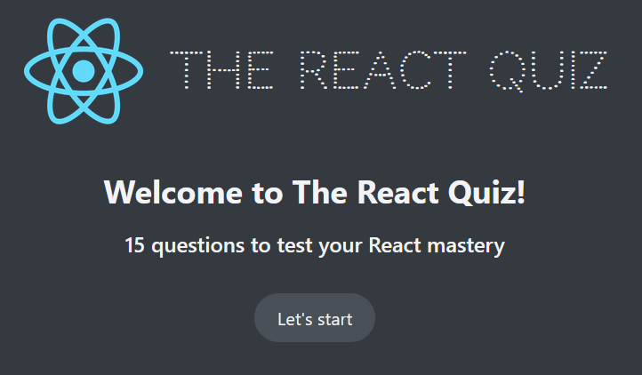
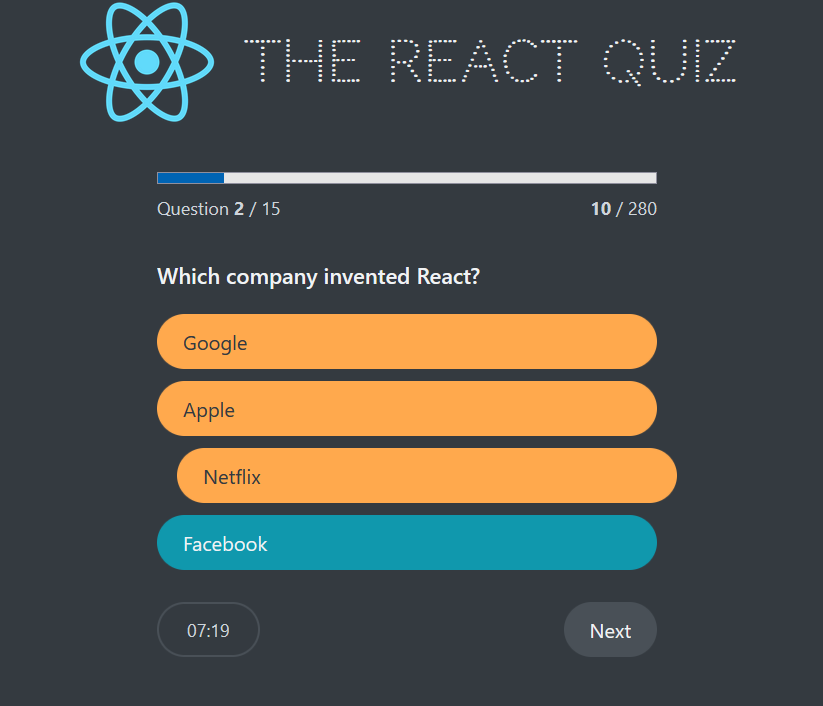

# 🧠 The React Quiz

A fun and interactive quiz app built with **React** to test your React knowledge. This project is inspired by **Jonas Schmedtmann’s Ultimate React Course** and follows modern React best practices such as hooks, controlled state, and clean component architecture.

---

## 🚀 Features

* ✅ 15 carefully curated React questions
* ⏱️ Timer-based quiz experience
* 📊 Progress bar with score tracking
* 🎯 Multiple-choice answers
* 🟢 Instant visual feedback for selected answers
* 🔄 Restart quiz anytime
* ⚡ Fast and lightweight UI

---

## 🖼️ Preview

> Welcome Screen & Question Screen
```md


```

---

## 🛠️ Built With

* **React** (useState, useEffect)
* **JavaScript (ES6+)**
* **CSS3** (Custom styling)
* **Vite / Create React App** (depending on your setup)

---

## 📂 Project Structure

```bash
src/
├── components/
│   ├── Header.jsx
│   ├── Main.jsx
│   ├── Question.jsx
│   ├── Options.jsx
│   ├── Progress.jsx
│   ├── Timer.jsx
│   └── Footer.jsx
├── data/questions.js
├── App.jsx
├── index.css
└── main.jsx
```

---

## ⚙️ How It Works

1. The quiz loads questions from a local data file.
2. Each question has multiple options and a correct answer.
3. Selecting an answer updates the score.
4. A timer limits how long you can think 😄
5. Final score is shown at the end with an option to restart.

---

## ▶️ Getting Started

### 1️⃣ Clone the Repository

```bash
git clone https://github.com/SecurityTalent/React-Quiz-App.git
cd the-react-quiz
```

### 2️⃣ Install Dependencies

```bash
npm install
```

### 3️⃣ Run the App

```bash
npm run dev

# or JSON Server: Fake REST API Run
npm run server

# "server": "json-server --watch Data/questions.json --port 8080"

```

Open 👉 `http://localhost:5173` (or `3000`) in your browser.

---

## 📚 What You’ll Learn

* Managing complex state in React
* Lifting state up
* Conditional rendering
* Handling timers with `useEffect`
* Building reusable components

---


## 📄 License

This project is for **learning purposes only**.

Feel free to fork, experiment, and improve it 🚀

---

### ⭐ If you like this project, give it a star on GitHub!
